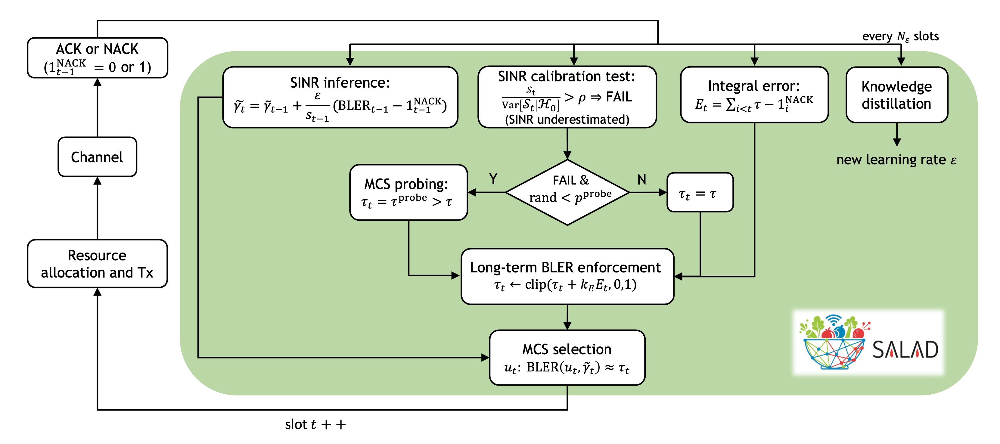
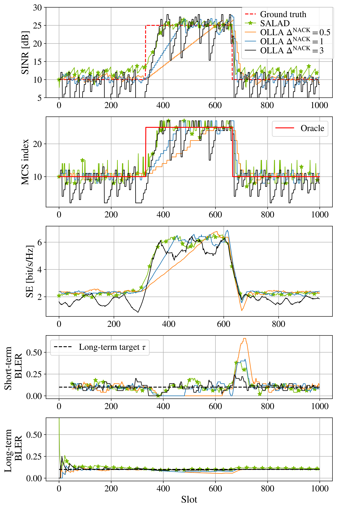
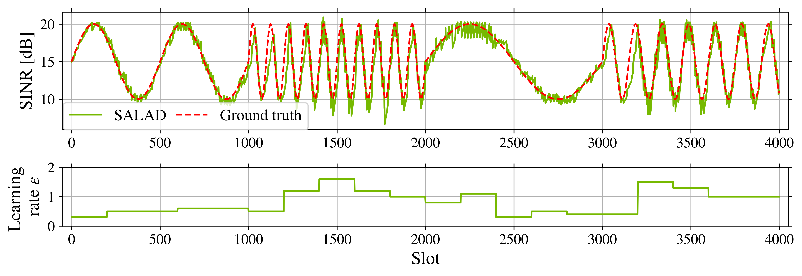

# Self-Adaptive Link Adaptation (SALAD)

The code in this repository allows users to evaluate the performance of
**Self-Adaptive Link Adaptation (SALAD)** algorithm [1] for adaptive modulation
and coding in wireless communications.

<p align="center"></p>

SALAD accurately tracks signal-to-interference-plus-noise
ratio (SINR) evolution using only ACK/NACK feedback and enables high spectral
efficiency while maintaining the block error rate (BLER) near a target value. 

Specifically, SALAD infers the SINR by minimizing the cross-entropy loss between received
ACK/NACKs and predicted BLER values. The inference learning rate self-adapts via
knowledge distillation in online fashion. 
Based on this inference, SALAD then selects the MCS via hypothesis testing: if the SINR is suspected to be underestimated, a higher MCS is selected to accelerate link adaptation under improving channel conditions. 

To prevent BLER drift from its long-term target, SALAD applies a feedback
control loop that adjusts the instantaneous BLER target. 

## Main takeaways

SALAD can both track rapid SINR variations and stabilize when the SINR remains constant.
In contrast, OLLA performs well only in one of these scenarios, depending on its
parametrization.

As a result, SALAD enables higher spectral efficiency while maintaining the long-term BLER at the target.
Moreover, SALAD is robust to HARQ feedback delay which force link adaptation to operate on stale information.

To see SALAD in action, you can have a look at the ["Meet SALAD" notebook](notebooks/meet_salad.ipynb).

<p align="center"></p>


SALAD can further enhance its adaptation capabilities via knowledge
distillation.
In fact, SALAD infers the SINR via a "student" gradient-descent algorithm with a learning
rate that is optimized periodically by distilling information from a more
powerful "teacher" estimator.

For more information, please refer to the ["Knowledge distillation"
notebook](notebooks/salad_knowledge_distillation.ipynb).

<p align="center"></p>

## Repository Structure

This repository is structured as follows:

- [algos](/algos): Implementation of the SALAD algorithm and the industry-standard outer-loop link adaptation (OLLA).
- [utils](/utils): Utility functions for SINR estimation, BLER modeling, and plotting.
- [notebooks](/notebooks): Jupyter notebooks to run experiments:
  - [Meet SALAD](/notebooks/meet_salad.ipynb): Evaluate SALAD's performance and
    benchmark it with OLLA for different SINR dynamics and HARQ feedback delay configurations
  - [Knowledge Distillation](/notebooks/salad_knowledge_distillation.ipynb):
    Perform knowledge distillation to let SALAD's learning rate self-adapt
    to the SINR variation speed
  - [BLER Sigmoid Fit](/notebooks/bler_sigmoid_fit.ipynb): Fit the SINR-vs-BLER
    tables with sigmoid functions, used by SALAD
- [data](/data): Contains a pre-computed CSV file with (SINR,MCS) vs. BLER tables along with their
  sigmoid approximation.
- [figs](/data): SALAD diagram and result figures.


## License

Copyright &copy; 2025, NVIDIA Corporation. All rights reserved.

This work is made available under the [NVIDIA License](LICENSE.txt).

## Citation

```
@software{salad,
    title = {SALAD: Self-Adaptative Link Adaptation},
    author = {Lorenzo Maggi, Reinhard Wiesmayr, Sebastian Cammerer, Jakob Hoydis, Fayçal Aït Aoudia, Alexander Keller},
    note = {https://github.com/NVlabs/salad},
    year = 2025
}
```

### Installation

You can install the required dependencies using:

```bash
pip install -r requirements.txt
```

## References

[1] R. Wiesmayr, L. Maggi, S. Cammerer, J. Hoydis, F. Aït Aoudia, A. Keller,
["SALAD: Self-Adaptative Link Adaptation"](https://arxiv.org), arXiv, 2025
